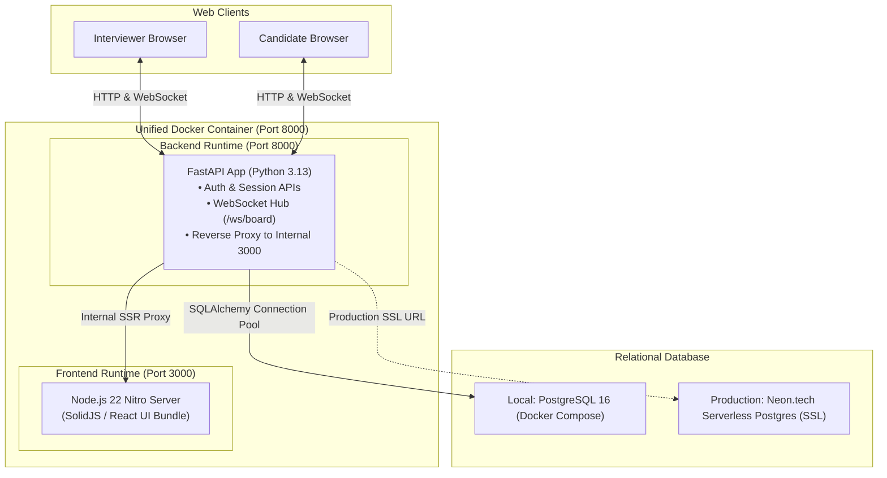
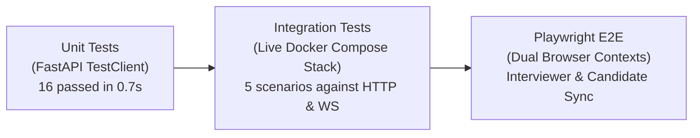
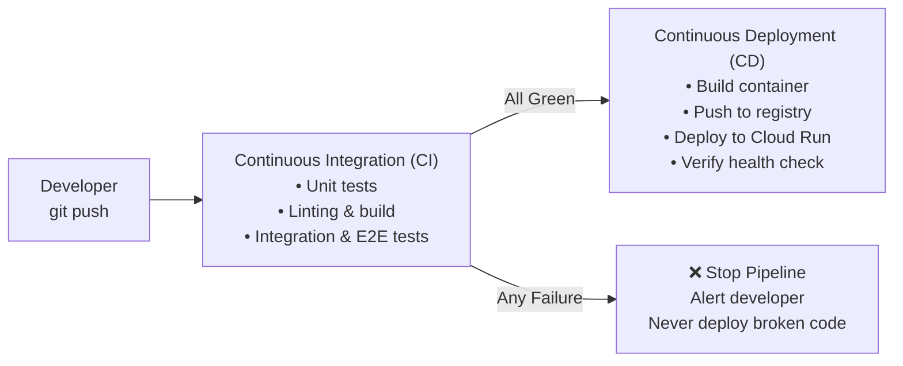
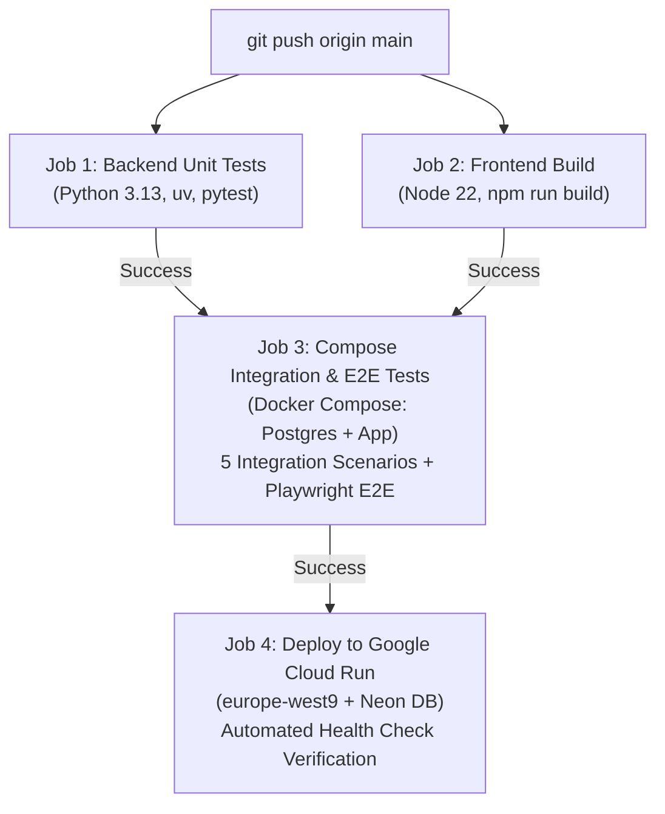

# System Design Interview Platform (SDIP) - Part 3
> **Containerization, Full-Stack Testing, and Cloud-Native CI/CD Pipeline**  
> *Part 3 of the AI Dev Tools Zoomcamp by DataTalks.Club*

[](https://github.com/SPBONIFACE/ai-dev-tools-zoomcamp-part3/actions/workflows/deploy.yml)

A production-ready collaborative system design interview platform. An interviewer can create an interview session, share an invite link with a candidate, and collaborate on a shared infinite canvas with real-time bidirectional WebSocket synchronization.

In **Part 3**, this application was transformed from a local development prototype into a containerized, thoroughly tested, and cloud-deployed application using **Google Cloud Run**, **Neon Serverless PostgreSQL**, and a 4-stage **GitHub Actions CI/CD Pipeline**.

---

## 📑 Table of Contents
- [Architecture Overview](#architecture-overview)
- [Quickstart (Docker Compose)](#quickstart-docker-compose)
- [Testing Suite](#testing-suite)
- [CI/CD Guide & Architecture Deep-Dive](#cicd-guide--architecture-deep-dive)
  - [1. What is CI/CD? The Big Picture](#1-what-is-cicd-the-big-picture)
  - [2. How Our Pipeline Works in GitHub Actions](#2-how-our-pipeline-works-in-github-actions)
  - [3. Why This Architecture is Production-Grade](#3-why-this-architecture-is-production-grade)
- [Zero-Cost Cloud Infrastructure](#zero-cost-cloud-infrastructure)
- [Project Structure](#project-structure)

---

## Architecture Overview



### Key Architectural Characteristics
1. **Single Unified Container:** The multi-stage [`Dockerfile`](./Dockerfile) builds the frontend with Node.js 22 and packages it inside a lightweight Python 3.13-slim runtime. FastAPI serves both the REST API, the WebSockets, and the frontend SSR bundle.
2. **Zero-Setup Database Migrations:** Database tables and constraints are managed via SQLAlchemy models with automatic table creation upon startup, adapting seamlessly between local PostgreSQL and cloud-hosted PostgreSQL with connection pooling.
3. **Real-Time Canvas Sync:** Broadcasts canvas operations (`upsert`, `delete`, `move`) across WebSockets with in-memory presence tracking and persistent database storage.

---

## Quickstart (Docker Compose)

The easiest way to run the entire full-stack application locally with real PostgreSQL is Docker Compose:

### 1. Start the Stack
```bash
docker compose up --build
```
* PostgreSQL starts on `localhost:5432` with an automated healthcheck.
* The unified app starts on `http://localhost:8100`.

### 2. Access the Application
* **Web UI:** [http://localhost:8100](http://localhost:8100)
* **Interactive API Docs (Swagger):** [http://localhost:8100/docs](http://localhost:8100/docs)
* **Health Check:** [http://localhost:8100/api/health](http://localhost:8100/api/health)

### 3. Stop the Stack
```bash
docker compose down
```

---

## Testing Suite

The repository contains three levels of automated testing:



### 1. Backend Unit Tests
Runs fast, isolated tests for authentication, session creation, board operations, and WebSocket message framing:
```bash
make test
# Or: cd backend && uv run pytest -v
```

### 2. Compose Integration Tests
Runs against the live Docker Compose container stack (`http://localhost:8100`):
```bash
make test-integration
# Or: cd backend && uv run pytest -v ../e2e/test_compose_integration.py
```
* **Scenario 1:** Container readiness & health check (`/api/health`).
* **Scenario 2:** Frontend bundle delivery at root (`/`).
* **Scenario 3:** User registration, password hashing, and JWT token authentication.
* **Scenario 4:** Session creation, join-token generation, candidate unauthenticated access, and PostgreSQL persistence.
* **Scenario 5:** Live bidirectional WebSocket synchronization between candidate and interviewer.

### 3. Playwright Dual-Browser End-to-End Test
Launches two isolated browser contexts simulating an interviewer and a candidate on the canvas:
```bash
make e2e
# Or: cd backend && uv run pytest -v ../e2e/test_two_session_e2e.py
```

---

# CI/CD Guide & Architecture Deep-Dive

## 1. What is CI/CD? The Big Picture

In traditional software development without CI/CD:
1. Developers write code locally (*"It works on my machine!"*).
2. Code gets merged manually.
3. Things break unexpectedly in production because dependencies, environment variables, or databases differ.
4. Someone manually SSHs into a server late at night to pull files and restart processes, risking downtime and configuration drift.

**CI/CD automates this entire lifecycle so humans never have to perform manual deployments.**



### Part A: CI = Continuous Integration
* **The Goal:** Continuously integrate code changes into the shared repository without breaking existing functionality.
* **How it works:** Every time code is pushed or a Pull Request is opened, automated virtual runners spin up in the cloud, pull the code, install dependencies, and execute test suites.
* **Why it matters:** If someone introduces a typo, breaks an API contract, or introduces a regression, CI catches it in seconds **before** the code ever reaches production.

### Part B: CD = Continuous Delivery / Deployment
* **Continuous Delivery:** Code is automatically tested and packaged into a production-ready artifact (e.g., a Docker container), ready to deploy at the push of a button.
* **Continuous Deployment (what this project uses):** Every commit that merges into `main` and passes all CI tests is **automatically deployed to live cloud infrastructure without manual approval or intervention**.

---

## 2. How Our Pipeline Works in GitHub Actions

The pipeline is defined in [`.github/workflows/deploy.yml`](.github/workflows/deploy.yml). It follows modern software engineering best practices: **Fail-Fast Parallel Execution** followed by **Progressive Gating**.



### Deep Dive into the 4 Pipeline Jobs:

#### ⚡ Job 1: Backend Tests (Parallel)
* **Runner:** `ubuntu-latest`.
* **What it does:** Sets up Python 3.13, syncs dependencies via `uv`, and executes `pytest` across all 16 backend unit tests.
* **Why it runs first in parallel:** Unit tests are blazingly fast (taking **~0.7 seconds**). If a backend route or auth logic is broken, the pipeline fails immediately without wasting minutes spinning up Docker containers.

#### ⚡ Job 2: Frontend Tests (Parallel)
* **Runner:** `ubuntu-latest`.
* **What it does:** Sets up Node.js 22, installs dependencies, and runs `NITRO_PRESET=node-server npm run build`.
* **Why it runs first in parallel:** Catches TypeScript errors, missing packages, or broken bundler configurations simultaneously alongside Job 1.

#### 🐳 Job 3: Compose Integration & Playwright E2E Tests (The Gatekeeper)
* **Dependency:** `needs: [backend-tests, frontend-tests]` — will **only execute if Jobs 1 & 2 passed**.
* **What it does:**
  1. Spins up the multi-container stack: `docker compose up --build -d` (PostgreSQL 16 + Unified Full-Stack Container).
  2. Runs a resilient wait loop until `http://localhost:8100/api/health` reports healthy.
  3. Installs headless **Chromium** via Playwright.
  4. Executes the **5 Integration Test Scenarios** against the running container.
  5. Executes the **Playwright E2E Test**: Opens two isolated browser sessions simulating an **Interviewer** and a **Candidate** collaborating on the canvas in real time.
* **Why it matters:** Unit tests verify code in isolation with mocks. This job proves that **the exact production Docker container works against real PostgreSQL and real web browsers**.

#### 🚀 Job 4: Deploy to Google Cloud Run (Continuous Deployment)
* **Dependency:** `needs: [integration-and-e2e]` and `if: github.ref == 'refs/heads/main'`.
* **What it does:**
  1. Authenticates securely to Google Cloud using the `GCP_SA_KEY` GitHub Secret.
  2. Builds the container image and deploys it to **Google Cloud Run** in `europe-west9`.
  3. Injects the production database URL from GitHub Secrets (`SDIP_DATABASE_URL` pointing to Neon PostgreSQL).
  4. Configures autoscaling to zero (`--min-instances 0`) and allocates 512Mi memory.
  5. **Automated Health Check Verification:** Queries `gcloud run services describe` to extract the live service URL, then issues retried HTTP requests to `$SERVICE_URL/api/health` to confirm the deployment is healthy before marking the workflow green.

---

## 3. Why This Architecture is Production-Grade

1. **Zero Secret Leaks:**
   * No database passwords, API tokens, or GCP service account keys exist in the repository.
   * All production credentials are injected strictly at runtime via encrypted **GitHub Actions Secrets** (`GCP_SA_KEY`, `SDIP_DATABASE_URL`).
2. **Zero-Cost Serverless Autoscaling:**
   * **Google Cloud Run:** Configured with `--min-instances 0`. When no users are active, instances scale to zero (0 € computing cost). When requests arrive, instances scale up automatically in seconds.
   * **Neon PostgreSQL:** Serverless PostgreSQL that pauses compute automatically after 5 minutes of inactivity, remaining within the free tier.
3. **Zero-Downtime Rolling Deployments:**
   * Google Cloud Run uses revision-based deployments. If a newly deployed revision fails its startup probe or health check, traffic is never switched to it, protecting end users from outages.
4. **Environment Parity:**
   * Both local development (`docker compose`) and production deployment (`Cloud Run`) use the exact same multi-stage `Dockerfile` and identical PostgreSQL drivers (`psycopg2-binary`).

---

## Zero-Cost Cloud Infrastructure

| Component | Provider | Configuration | Cost |
| :--- | :--- | :--- | :--- |
| **Compute & Serving** | Google Cloud Run (`europe-west9`) | `--min-instances 0 --max-instances 2 --memory 512Mi` | Free Tier (0 €) |
| **Relational Database** | Neon.tech Serverless PostgreSQL | PostgreSQL 16 with SSL (`sslmode=require`) & auto-pause | Free Tier (0 €) |
| **Container Registry** | Google Artifact Registry | Storing application container images | Free Tier |
| **CI/CD Automation** | GitHub Actions | 2,000 free runner minutes/month | Free Tier (0 €) |

---

## Project Structure

```
.
├── .github/workflows/
│   └── deploy.yml            # 4-stage automated CI/CD pipeline
├── backend/
│   ├── src/backend/
│   │   ├── main.py           # FastAPI entrypoint, routes, and WebSocket hub
│   │   ├── database.py       # SQLAlchemy engine & session maker (Neon + Local PG)
│   │   └── models.py         # ORM models (User, Session, BoardState)
│   ├── tests/                # 16 isolated backend unit tests
│   └── pyproject.toml        # Python project configuration (uv)
├── e2e/
│   ├── test_compose_integration.py  # 5 multi-container integration tests
│   └── test_two_session_e2e.py      # Playwright dual-browser E2E test
├── frontend/
│   ├── src/                  # SolidJS / React Canvas frontend
│   └── package.json          # Node 22 build scripts
├── Dockerfile                # Multi-stage container build (Node 22 + Python 3.13)
├── docker-compose.yaml       # Multi-container local stack (PostgreSQL + App)
├── Makefile                  # Developer CLI shortcuts (make test, make e2e)
├── start.sh                  # Container entrypoint script
└── README.md                 # Project documentation & CI/CD learning guide
```
